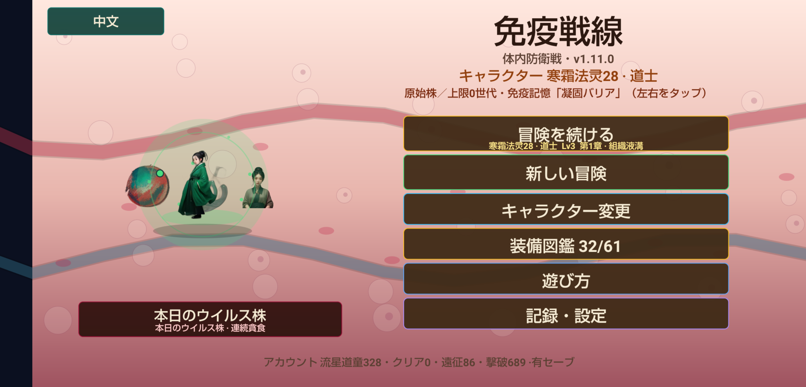
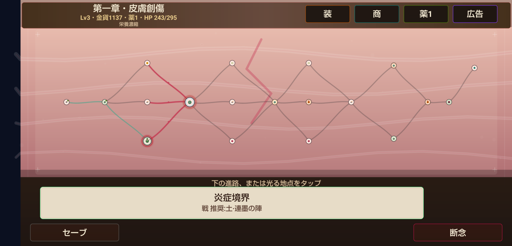
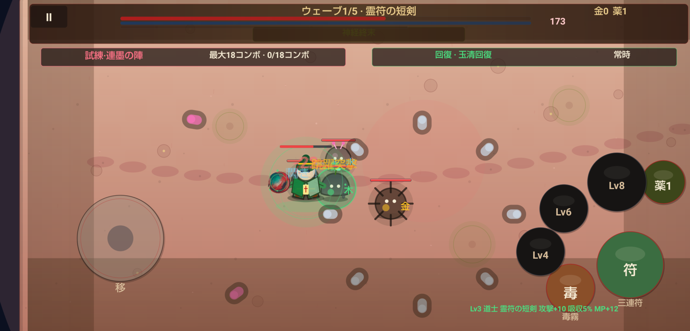

# 免疫戦線（JellyStorage）

人体内の免疫戦争をテーマにした、横画面のローグライク・アクションRPGです。プレイヤーは白血球の戦士を操作し、皮膚、肺、消化管、肝臓、心臓を巡りながら、細菌、ウイルス、感染コアと戦います。装備、五行相性、スキルビルドを組み合わせ、世代ごとに変異する敵へ挑みます。

> 現在のバージョン：`1.12.0` · Android向けプレイアブルプロトタイプ · 日本語／簡体字中国語対応

## スクリーンショット

### タイトル画面



### 臓器ルートマップ



### リアルタイム戦闘



## ゲームの特徴

- 固有のマップ、戦闘環境、敵、ボスギミックを持つ5つの臓器チャプター
- 戦士、魔法使い、道士の3職業と、移動・通常攻撃・アクティブスキルによるリアルタイム戦闘
- 武器、防具、指輪、靴、セット効果と、木・火・土・金・水の五行相性
- 分岐ルート、ランダムイベント、ルーム試練、プレイ中の3択強化
- デイリー感染株、共有シード遠征、図鑑チャレンジ、職業別スキン試練
- クリア後にウイルスが次世代へ変異し、免疫記憶を残して装備とスキルを再構築する周回システム
- 外部ゲームエンジンを使用しない、プロシージャルな軟体キャラクターとCanvasエフェクト
- ローカルセーブ、ゲーム内言語切り替え、AdMobのインタースティシャル広告／リワード広告

## 技術構成

- Kotlin、Jetpack Compose、Material 3
- Compose Canvasによる独自描画と`VerletJellyMesh`による軟体物理
- Android `minSdk 26`、`targetSdk 36`、Java 17
- Gradle 8.12、Android Gradle Plugin 8.9.1

## ローカルでのビルド

Android Studio付属のJDK 17とAndroid SDK 36を用意してください。

```bash
./gradlew assembleDebug
./gradlew testDebugUnitTest
./gradlew lintDebug
```

Windowsでは`./gradlew`を`gradlew.bat`に置き換えられます。DebugビルドはGoogle公式のテスト広告IDを使用するため、本番用広告設定は不要です。

Google Play向けのビルドでは、`release.properties.example`を`release.properties`へコピーし、署名、AdMob、プライバシーポリシーの設定を入力してから次を実行します。

```bash
./gradlew -PplayStoreRelease=true bundleRelease
```

`release.properties`、キーストア、本番用広告情報はコミットしないでください。

## プロジェクト構成

```text
app/src/main/java/com/jellystorage/
├── play/       # 現行ゲーム、マップ、戦闘、装備、物語、ローカライズ
├── engine/     # 戦闘シミュレーション、シナジー、軟体物理
├── run/        # ローグライク進行モデル
└── softbody/   # 描画支援と、現行フローでは未使用の旧ゲームモード
```

起動フローは`MainActivity → GameView → PlayScreen`です。ユニットテストは`app/src/test`、端末上の描画・タッチテストは`app/src/androidTest`にあります。開発前に[AGENTS.md](AGENTS.md)を確認してください。ストア公開関連資料は[docs/](docs/)にあります。

## コントリビューション

不具合報告やゲームプレイへの提案はIssueで受け付けています。Pull Requestは変更範囲を絞り、実施したテストを明記してください。画面、マップ、戦闘表現を変更する場合は、横画面のスクリーンショットまたは動画も添付してください。提出前に、少なくともユニットテストと対象モジュールのビルドを実行してください。

## ライセンス

本リポジトリには現在、オープンソースライセンスが付与されていません。GitHubの利用規約で認められる閲覧・フォークを除き、ソースコードおよびアート素材に関する権利はプロジェクト所有者が保持します。利用や協業を希望する場合は、事前にリポジトリ所有者へお問い合わせください。
